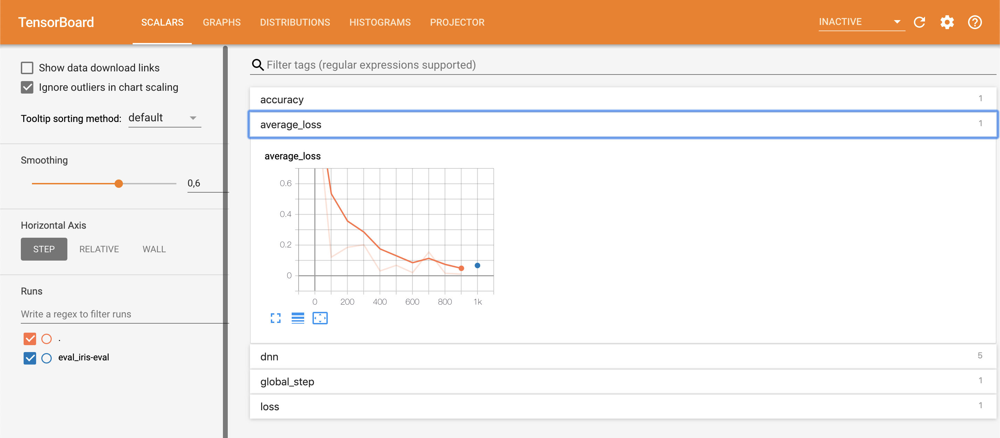

# Deep Learning on Google ML Engine _(AI Platform)_

This tutorial is an introduces on how to train deep learning models on Google ML Engine (now AI Platform). This is  a tool developed by Google to make it easier to take ML projects from ideation to production. 

**Note**: This tutorial is an adaption of the [Getting Started Training Prediction](https://cloud.google.com/ml-engine/docs/tensorflow/getting-started-training-prediction) tutorial.

#### A bit of background on Machine Learning

Machine learning is essentially what the term suggests -  the learning of machines, particularly, computer systems. Machine learning enables computer systems to learn from examples in order to predict outcomes without being explicitly programmed by humans. Oftentimes large data sets are required to accurately train the computer system; therefore a great amount of force is needed by the neural networks. This limitation can be solved by the application of deep learning. 

#### What is deep learning?

[Deep learning](https://en.wikipedia.org/wiki/Deep_learning) is a class of machine learning algorithms that: use multiple layers to progressively extract higher level features from raw input.

In esssence deep learning is achieved by training computer systems to learn algorithms by the use of neural networks; these neural networks mimic the biological neurons of the human brain. The neural networks are based on a set of multiple layers which are connected to each other; the main function of these neural networks is to use inputted data to accurately predict outputs using progressively complex calculations. 

#### Overview

The main focus of this tutorial is on how to train a deep learning model on Google's **AI Platform** and less on how to develop a deep learning model & the science behind that.

In this tutorial we are going to make use of the [Iris flower data set](https://en.wikipedia.org/wiki/Iris_flower_data_set) to train a [deep neural network](https://en.wikipedia.org/wiki/Deep_learning#Deep_neural_networks) and classify different flower species. We are going to use the [DNNClassifier tensorflow estimator](https://www.tensorflow.org/api_docs/python/tf/estimator/DNNClassifier) to train the model and parkage it as an application to be deployed on AI platform.

## Setting up and testing your Cloud environment

Complete the following steps to set up a GCP account, activate the AI Platform API, and install and activate the Cloud SDK.

### Set up your GCP project

1. Select or create a Google Cloud Platform project. [Go To The Manager Resources Page](https://console.cloud.google.com/cloud-resource-manager?_ga=2.76460885.-191603348.1557563231&_gac=1.225252840.1560609624.Cj0KCQjwrpLoBRD_ARIsAJd0BIUJfEWlDGh6bNrvDH2UKP5XlBf20OuNWUZ8JLdQI_gZT4MUzqWhrPgaAijZEALw_wcB)

2. Make sure that billing is enabled for your Google Cloud Platform project. [Learn How To Enable Billing](https://cloud.google.com/billing/docs/how-to/modify-project)

3. Enable the AI Platform ("Cloud Machine Learning Engine") and Compute Engine APIs. [Enable The APIs](https://console.cloud.google.com/flows/enableapi?apiid=ml.googleapis.com,compute_component&_ga=2.76455765.-191603348.1557563231&_gac=1.254719482.1560609624.Cj0KCQjwrpLoBRD_ARIsAJd0BIUJfEWlDGh6bNrvDH2UKP5XlBf20OuNWUZ8JLdQI_gZT4MUzqWhrPgaAijZEALw_wcB)

4. [Install and initialize the Cloud SDK](https://cloud.google.com/sdk/docs/).

## Training locally

#### Create a virtual environment

1. Install virtualenv
   `virtualenv` is a tool to create isolated Python environments. Check if you already have `virtualenv` installed by running `virtualenv --version`.

   ```console
   pip install --user --upgrade virtualenv
   ```

   To create an isolated development environment for this guide, create a new virtual environment in virtualenv. For example, the following command activates an environment named `cmle-env`:

   ```console
   virtualenv cmle-env --python=python2.7
   source cmle-env/bin/activate
   ```

2. For the purposes of this tutorial, run the rest of the commands within your virtual environment.

#### Get your training data

The relevant data files for training, `iris_training.csv` and `iris_test.csv`, are stored in the `data` folder.

1. Set the `TRAIN_DATA` AND `EVAL_DATA` variables to your local file paths. For example, the following commands set the variables to local paths.

   ```console
   TRAIN_DATA=$(pwd)/data/iris_training.csv
   EVAL_DATA=$(pwd)/data/iris_test.csv
   ```

2. Install dependencies

   ```console
   pip install -r ../requirements.txt
   ```

#### Run a local training job

A local training job loads your Python training program and starts a training process in an environment that's similar to that of a live AI Platform cloud training job.

1. Specify an output directory and set a `MODEL_DIR` variable. The following command sets `MODEL_DIR` to a value of output.

   ```console
   MODEL_DIR=output
   ```

2. It's a good practice to delete the contents of the output directory in case data remains from a previous training run. The following command deletes all data in the output directory.

   ```console
   rm -rf $MODEL_DIR/*
   ```

3. To run your training locally, run the following command:

   ```console
   gcloud ai-platform local train \
       --module-name trainer.task \
       --package-path trainer/ \
       --job-dir $MODEL_DIR \
       -- \
       --train-files $TRAIN_DATA \
       --eval-files $EVAL_DATA \
       --train-steps 1000 \
       --eval-steps 100
   ```

4. Inspect the summary logs using Tensorboard

   ```console
   tensorboard --logdir=$MODEL_DIR
   ```

   When you have started running TensorBoard, you can access it in your browser at http://localhost:6006

   Click on **Accuracy** to see graphical representations of how accuracy changes as your job progresses.
   

## Training in the cloud

#### Set up your Cloud Storage bucket

This section shows you how to create a new bucket. You can use an existing bucket, but if it is not part of the project you are using to run AI Platform, you must explicitly [grant access to the AI Platform service accounts](https://cloud.google.com/ml-engine/docs/tensorflow/working-with-cloud-storage#setup-different-project).

1. Specify a name for your new bucket. The name must be unique across all buckets in Cloud Storage.

   ```console
   BUCKET_NAME="your_bucket_name"
   ```

   For example, use your project name with `-mlengine` appended:

   ```console
   PROJECT_ID=$(gcloud config list project --format "value(core.project)")
   BUCKET_NAME=${PROJECT_ID}-mlengine
   ```

2. Check the bucket name that you created.

   ```console
    echo $BUCKET_NAME
   ```

3. Select a region for your bucket and set a REGION environment variable.

   For example, the following code creates REGION and sets it to `us-central1`:

   ```console
    REGION=us-central1
   ```

4. Create the new bucket:

   ```console
    gsutil mb -l $REGION gs://$BUCKET_NAME
   ```

   Note: Use the same region where you plan on running AI Platform jobs. The example uses `us-central1` because that is the region used in the getting-started instructions.

#### Upload the data files to your Cloud Storage bucket.

1. Use `gsutil` to copy the two files to your Cloud Storage bucket.

   ```console
   BUCKET_NAME="your_bucket_name"
   ```

2. Set the `TRAIN_DATA` and `EVAL_DATA` variables to point to the files.

   ```console
    TRAIN_DATA=gs://$BUCKET_NAME/data/iris_training.csv
    EVAL_DATA=gs://$BUCKET_NAME/data/iris_test.csv
   ```

3. Use `gsutil` again to copy the JSON test file `test.json` to your Cloud Storage bucket.

   ```console
    gsutil cp ../test.json gs://$BUCKET_NAME/data/test.json
   ```

4. Set the `TEST_JSON` variable to point to that file.

   ```console
    TEST_JSON=gs://$BUCKET_NAME/data/test.json
   ```

#### Run a single-instance training job in the cloud

With a validated training job that runs in both single-instance and distributed mode, you're now ready to run a training job in the cloud. You'll start by requesting a single-instance training job.

Use the default `BASIC` [scale tier](https://cloud.google.com/ml-engine/docs/tensorflow/machine-types) to run a single-instance training job. The initial job request can take a few minutes to start, but subsequent jobs run more quickly. This enables quick iteration as you develop and validate your training job.

1. Select a name for the initial training run that distinguishes it from any subsequent training runs. For example, you can append a number to represent the iteration.

   ```console
   JOB_NAME=iris_single_1
   ```

2. Specify a directory for output generated by AI Platform by setting an `OUTPUT_PATH` variable to include when requesting training and prediction jobs. The `OUTPUT_PATH` represents the fully qualified Cloud Storage location for model checkpoints, summaries, and exports. You can use the `BUCKET_NAME` variable you defined in a previous step.

   It's a good practice to use the job name as the output directory. For example, the following OUTPUT_PATH points to a directory named `iris_single_1`.

   ```console
    OUTPUT_PATH=gs://$BUCKET_NAME/$JOB_NAME
   ```

3. Run the following command to submit a training job in the cloud that uses a single process. This time, set the `--verbosity` tag to `DEBUG` so that you can inspect the full logging output and retrieve accuracy, loss, and other metrics. The output also contains a number of other warning messages that you can ignore for the purposes of this sample.

   ```console
    gcloud ai-platform jobs submit training $JOB_NAME \
      --job-dir $OUTPUT_PATH \
      --runtime-version 1.10 \
      --module-name trainer.task \
      --package-path trainer/ \
      --region $REGION \
      -- \
      --train-files $TRAIN_DATA \
      --eval-files $EVAL_DATA \
      --train-steps 1000 \
      --eval-steps 100 \
      --verbosity DEBUG
   ```

You can monitor the progress of your training job by watching the command-line output or in AI Platform > Jobs on [Google Cloud Platform Console](https://console.cloud.google.com/mlengine/jobs?_ga=2.30907391.-191603348.1557563231&_gac=1.224851560.1560609624.Cj0KCQjwrpLoBRD_ARIsAJd0BIUJfEWlDGh6bNrvDH2UKP5XlBf20OuNWUZ8JLdQI_gZT4MUzqWhrPgaAijZEALw_wcB).

#### Deploy a model to support prediction

1. Choose a name for your model; this must start with a letter and contain only letters, numbers, and underscores. For example:

   ```console
   MODEL_NAME=iris
   ```

2. Create an AI Platform model:

   ```console
   gcloud ai-platform models create $MODEL_NAME --regions=$REGION

   ```

3. Select the job output to use. The following sample uses the job named iris_single_1.

   ```console
   OUTPUT_PATH=gs://$BUCKET_NAME/iris_single_1
   ```

4. Look up the full path of your exported trained model binaries:

   ```console
   gsutil ls -r $OUTPUT_PATH/export
   ```

5. Find a directory named `$OUTPUT_PATH/export/iris/<timestamp>` and copy this directory path (without the : at the end) and set the environment variable MODEL_BINARIES to its value. For example:

   ```console
   MODEL_BINARIES=gs://$BUCKET_NAME/census_dist_1/export/iris/1487877383942/
   ```

   Where `$BUCKET_NAME` is your Cloud Storage bucket name, and iris_single_1 is the output directory.

6. Run the following command to create a version `v1`:

   ```console
   gcloud ai-platform versions create v1 \
       --model $MODEL_NAME \
       --origin $MODEL_BINARIES \
       --runtime-version 1.10
   ```

You can get a list of your models using the models list command.

```console
gcloud ai-platform models list
```

#### Send an online prediction request to a deployed model

You can now send prediction requests to your model. For example, the following command sends an online prediction request using a `test.json` file inside the `data` folder.

```console
gcloud ai-platform predict \
    --model $MODEL_NAME \
    --version v1 \
    --json-instances data/test.json
```
